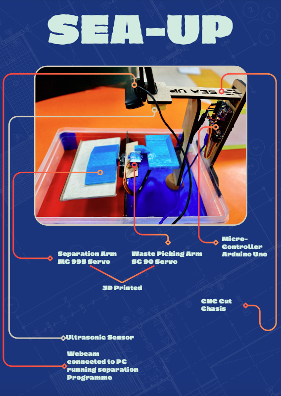

<!-- README.md -->

<h1 align="center" style="color: #4CAF50;">Waste Segregation with Roboflow and Arduino</h1>

Waste Segregation with Roboflow and Arduino utilizes computer vision and machine learning to identify and sort recyclable plastics, automating the recycling process. By employing Roboflow's pre-trained model and Arduino for servo motor control, this project reduces human labor and enhances recycling rates, addressing the urgent need for effective waste management.

  

 

<h2 style="color: #f39c12; text-align: center; margin-top: 20px;">Technologies Used</h2>
<ul style="font-size: 1.1em; text-align: center;">
    <li><strong>Roboflow</strong>: For the pre-trained model to detect recyclable plastics.</li>
    <li><strong>OpenCV</strong>: For video capture and frame processing.</li>
    <li><strong>Python</strong>: Programming language used for backend development.</li>
    <li><strong>PySerial</strong>: Library for serial communication with Arduino.</li>
    <li><strong>Arduino</strong>: For controlling the servo motor based on detection results.</li>
</ul>

 

<h2 style="color: #f39c12; text-align: center; margin-top: 20px;">Concept and Need</h2>

Recycling is a crucial process in waste management, aimed at reducing waste, conserving natural resources, and minimizing environmental impact. Manual sorting of recyclable materials is labor-intensive, time-consuming, and prone to human error. Automating this process with technology can significantly enhance efficiency and accuracy.

<strong>Waste Segregation with Roboflow and Arduino</strong> offers a smart solution to this problem. By using computer vision and machine learning, it accurately identifies various types of recyclable plastics. The integration with Arduino allows for precise control of the sorting mechanism, making the recycling process faster and more reliable.

 

<h2 style="color: #f39c12; text-align: center; margin-top: 20px;">Installation</h2>
<ol style="font-size: 1.1em; text-align: center;">
    <li><strong>Clone the repository:</strong>
        <pre><code>git clone https://github.com/your-username/Waste-Segregation-Roboflow-Arduino.git</code></pre>
    </li>
    <li><strong>Navigate to the project directory:</strong>
        <pre><code>cd Waste-Segregation-Roboflow-Arduino</code></pre>
    </li>
    <li><strong>Install dependencies:</strong>
        <pre><code>pip install -r requirements.txt</code></pre>
    </li>
    <li><strong>Create a `.env` file in the root directory and add your API keys:</strong>
        <pre><code>ROBOFLOW_API_KEY=your_roboflow_api_key_here</code></pre>
    </li>
    <li><strong>Connect your Arduino and upload the appropriate sketch to it.</strong></li>
    <li><strong>Run the script:</strong>
        <pre><code>python inference_arduino.py</code></pre>
    </li>
</ol>

 

<h2 style="color: #f39c12; text-align: center; margin-top: 20px;">Usage</h2>
<ul style="font-size: 1.1em; text-align: center;">
    <li>The script initializes the camera and continuously captures video frames.</li>
    <li>Type <code>s</code> in the terminal to send the current frame to Roboflow for inference.</li>
    <li>The detected plastic type will determine the command sent to the Arduino to sort the plastic.</li>
</ul>

 

<h2 style="color: #f39c12; text-align: center; margin-top: 20px;">Contributing</h2>

Contributions are welcome! If you have any suggestions, improvements, or new features to add, feel free to open an issue or create a pull request.

---

  <h2>Waste Segregation with Roboflow and Arduino - Automate Your Recycling</h2>
  
Identify and sort recyclable plastics efficiently using computer vision and machine learning.

